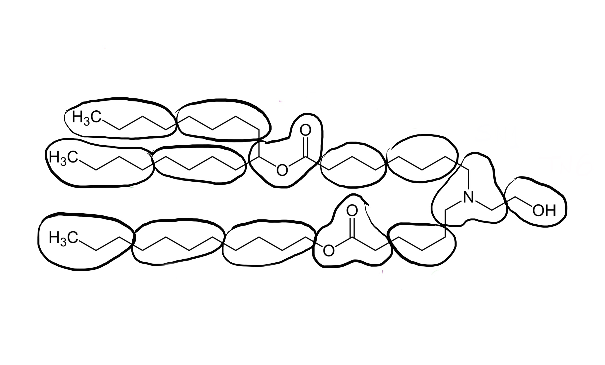

# Parametrizing a ionizable lipid to Martini3
This tutorial aims to showcase the parametrization of ionizable lipids to Martini3.

Adapted from the [Parametrization of a new small molecule](https://github.com/ricalessandri/Martini3-small-molecules/blob/main/tutorials/M3tutorials--parameterizing-a-new-small-molecule.md) Martini 3 Tutorial.

Files required and worked examples for this tutorial can be downloaded here.

## Table of contents

[Introduction](#introduction)

[1) Generate atomistic reference data](#1-generate-atomistic-reference-data)

[2) Atom-to-bead mapping](#2-atom-to-bead-mapping)

3) Generate the CG mapped trajectory from the atomistic simulation

4) Create the initial CG itp and tpr files

5) Generate target CG distributions from the CG mapped trajectory

6) Create the CG simulation

7) Optimize CG bonded parameters

8) Comparison to experimental results, further refinements, and final considerations

References and notes

## Introduction

In this tutorial we will learn how to build a Martini 3 topology for an ionizable lipid. The aim is to have a pragmatic description of the Martini 3 coarse-graining (CGing) principles [1,2], which follow the main ideas outlined in the seminal Martini 2 work [3].

We will use as an example the molecule SM-102 (Fig. 1), and make use of Gromacs versions 2024.x or later. Required files and worked examples can be downloaded here.

<p align="center">

</p>

## 1) Generate atomistic reference data

We will need atomistic reference data to extract bonded parameters for the CG model. Note that we will need all the hydrogen atoms to extract bond lengths further down this tutorial, so make sure that your atomistic structure contains all the hydrogens.

Here, we will use the LigParGen server [6] as a way to obtain an atomistic (or all-atom, AA) structure and molecule topology based on the OPLS-AA force field, but of course feel free to use your favorite atomistic force field. Other web-based services such as the automated topology builder (ATB) or CHARMM-GUI can also be used to obtain reference topologies based on other AA force fields. Another important option is to look in the literature for atomistic studies of the molecule you want to parametrize: if you are lucky, somebody might have already published a validated atomistic force field for the molecule, which you can then use to create reference atomistic simulations.

Start by feeding the SMILES string for 1-ethylnaphthalene (namely, CCc1cccc2ccccc21) to the LigParGen server, and pick the "1.14*CM1A-LBCC (Neutral molecules)" charge model (nothing special about this choice of charge model). After submitting the molecule, the server will generate input parameters for several molecular dynamics (MD) packages. Download the structure file (PDB) as well as the OPLS-AA topology in the GROMACS format (TOP) and rename them ENAP_LigParGen.pdb and ENAP_LigParGen.itp, respectively. You can now unzip the zip archive provided:

```
unzip  files-m3-newsm.zip
```

which contains a folder called ENAP-in-water that contains some template folders and useful scripts. We will assume that you will be carrying out the tutorial using this folder structure and scripts. Note that the archive contains also a folder called ENAP-worked where you will find a worked version of the tutorial (trajectories not included). This might be useful to use as reference to compare your files (e.g., to compare the ENAP_LigParGen.itp you obtained with the one you find in ENAP-worked/1_AA-reference).

We can now move to the first subfolder, 1_AA-reference, and copy over the files you just obtained from the LigParGen server:
```
cd     ENAP-in-water/1_AA-reference
[move here the obtained ENAP_LigParGen.pdb and ENAP_LigParGen.itp files]
```
Input files obtained from LigParGen may come with unknown residue names. Before launching the AA MD simulation, we will substitute the UNK residue name by ENAP. To do so, open the ENAP_LigParGen.pdb with your text editor of choice and replace the UNK entries on the 4th column of the ATOM records section. This column defines the residue name on a PDB file. Now open the ENAP_LigParGen.itp file and replace the UNK entries under the [ moleculetype ] directive and on the 4th column of the [ atoms ] directive. These define the residue name in a GROMACS topology file. (A lengthier discussion on GROMACS topology files will be given in section 4).) Alternatively, the following command - that relies on the Unix utility sed - will replace any UNK occurrence with ENAP (note the extra space after UNK which is important to keep the formatting of the pdb file!):

```
sed -i 's/UNK /ENAP/' ENAP_LigParGen.pdb
sed -i 's/UNK /ENAP/' ENAP_LigParGen.itp
```

Now launch the AA MD simulation:

```
bash prepare_1mol_AA_system.sh  ENAP_LigParGen.pdb  spc216.gro  SOL  3
```

The last command will run an energy-minimization, followed by an NPT equilibration of 250 ps, and by an MD run of 10 ns (inspect the script and the various mdp files to know more). Note that 10 ns is a rather short simulation time, selected for speeding up the current tutorial. You should rather use at least 50 ns, or an even longer running time in case of more complex molecules (you can try to experiment with the simulation time yourself!). In this case, the solvent used is water; however, the script can be adapted to run with any other solvent, provided that you input also an equilibrated solvent box. You should choose a solvent that represents the environment where the molecule will spend most of its time.

## 2) Atom-to-bead mapping

Mapping, i.e., splitting the molecule in building blocks to be described by CG beads, is the heart of coarse-graining and relies on experience, chemical knowledge, and trial-and-error. Here are some guidelines you should follow when mapping a molecule to a Martini 3 model
   * only non-hydrogen atoms are considered to define the mapping;
   * avoid dividing specific chemical groups (e.g., amide or carboxylate) between two beads;
    respect the symmetry of the molecule; it is moreover desirable to retain as much as possible the volume and shape of the underlying AA structure;
    default option for 4-to-1, 3-to-1 and 2-to-1 mappings are regular (R), small (S), and tiny (T) beads; they are the default option for linear fragments, e.g., the two 4-to-1 segments in octane;
   * R-beads are the best option in terms of computational performance, with the bead size reasonably good to represent 4-to-1 linear molecules;
   * T-beads are especially suited to represent the flatness of aromatic rings;
   * S-beads usually better mimic the "bulkier" shape of aliphatic rings;
    the number of beads should be optimized such that the maximum mismatch in mapping is ±1 non-hydrogen atom per 10 non-hydrogen atoms of the atomistic structure;
  * fully branched fragments should usually use beads of smaller size (the rational being that the central atom of a branched group is buried, that is, it is not exposed to the environment, reducing its influence on the interactions); for example, a neopentane group contains 5 non-hydrogen atoms but, as it is fully branched, you can safely model it as a regular bead.

In this example, first of all it is important to realize that, within Martini 3, conjugated, atom-thick structures are best described by Tiny (T) beads. This ensures packing-related properties closely matching atomistic data [1]-[2]. In this case, the 10 carbon atoms of the naphthalene moiety are therefore mapped to 5 T-beads, as shown in the figure below:

<p align="center">

</p>

Which leaves us with the ethyl group. A T-bead is again a good choice because the T-bead size is suited for describing 2 non-hydrogen atoms. Note that, the beads have also been numbered in the figure for further reference.

A good idea to settle on a mapping is to draw your molecule a few times on a piece of paper, come up with several mappings, compare them, and choose the one that best fulfills the guidelines outlined above.

## 3) Generate the CG mapped trajectory from the atomistic simulation

Using the mapping you just created, you will now transform the simulation you did at 1) to CG resolution. One way to do this is by creating a Gromacs (AA-to-CG) index file where every index group stands for a bead and contains the mapped atom numbers.

Instead of creating an index file by hand from scratch, an initial AA-to-CG index file can be obtained with the CGbuilder tool [7]. The intuitive GUI allows to map a molecule on the virtual environment almost as one does on paper. Just load the atomistic pdb/gro file of the molecule, click on the atoms you want to be part of the first bead, click again to remove them if you change your mind, create the next bead by clicking on the "new bead" button, and so on; finally, download the files once done. In fact, the tool allows also to obtain an initial CG configuration (a .gro file) for the beads and a CG-to-AA mapping file (a .map file) based on the chosen mapping. Doesn't this sound better than traditional paper?! Current caveats of CGbuilder include the fact that atoms cannot contribute with a weight different from 1 to a certain bead, something which is sometimes needed when mapping atomistic structures to Martini. In such cases, the index and/or mapping files should be subsequently refined by hand.

Before you get to it: an important change with respect to Martini 2.x is the fact that now hydrogen atoms are taken into account to determine the relative position of the beads when mapping an atomistic structure to CG resolution [1]-[2] - more on this later in this Section. This should be reflected in your AA-to-CG index file, that is, your index should also contain the hydrogens (in CGbuilder terms, click also on the hydrogens!). The general rule is to map a certain hydrogen atom to the bead which contains the non-hydrogen atom it is attached to.

You can now try to map the ENAP_LigParGen.pdb via CGbuilder. Once done, download the files that CGbuilder creates - ndx, map, and gro - to the 2_atom-to-bead-mapping folder:

```
cd ../2_atom-to-bead-mapping/
[download cgbuilder.ndx, cgbuilder.map, and cgbuilder.gro and move them to the current folder, i.e., '2_atom-to-bead-mapping']
```

and compare the files obtained to the ones provided in ENAP-worked/2_atom-to-bead-mapping where, besides the files we just explained, you can also find a screenshot (ENAP_cgbuilder.png) of the mapping as done with the CGbuilder tool. Note also that the files provided assume the beads to be ordered in the same way as shown in the Figure of Section 2); it is hence recommended to use the same order to greatly facilitate comparisons.

After having populated your own ENAP-in-water/2_atom-to-bead-mapping subfolder with - at least - the ndx file (let's call it ENAP_oplsaaTOcg_cgbuilder.ndx), move to the folder 3_mapped and copy over the index (we just rename it to mapping.ndx), that is:

```
cd  ../3_mapped
cp  ../2_atom-to-bead-mapping/ENAP_oplsaaTOcg_cgbuilder.ndx  mapping.ndx
```

Now, we took into account the hydrogens because center of geometry (COG)-based mapping of AA structures, done taking into account the hydrogen atoms, constitutes the standard procedure for obtaining bonded parameters in Martini 3 [1]-[2]. Hence, we need to consider the hydrogens when mapping the AA structure to CG resolution. Because of a gmx traj unexpected behavior (a potential bug, see note [8]), if we want to stick to gmx traj (like in the good ol' days; alternatives include, e.g., using the MDAnalysis Python library), we need a little hack before being able to run gmx traj. Namely, we need to first create an AA tpr file with the atoms of the atomistic structure all having the same mass. To do this, still from the 3_mapped folder, create a new itp with the modified masses:

```
cp  ../1_AA-reference/ENAP_LigParGen.itp  ENAP_LigParGen_COG.itp
```

Open ENAP_LigParGen_COG.itp with your text editor of choice and change the values on the 8th column under the [ atoms ] directive to an equal value (of, for example, 1.0). This column defines the atom mass in a GROMACS topology file. Now prepare a new top file which includes it:

```
cp  ../1_AA-reference/system.top                      system_COG.top
sed -i 's/ENAP_LigParGen.itp/ENAP_LigParGen_COG.itp/' system_COG.top
```
You can now run the script:

```
bash 3_map_trajectory_COG.sh
```
which will:

  1. first make sure that the AA trajectory is whole, i.e., your molecule of interest is not split by the periodic boundary conditions in one or more frames in the trajectory file (the gmx trjconv -pbc whole ... command);
  2. subsequently create a AA-COG.tpr, which will be used for the COG mapping in the following step (the gmx grompp -p ... command);
  3. finally, map the AA trajectory to CG resolution: the gmx traj -f... command contained in 3_map_trajectory_COG.sh will do COG-mapping because it uses the AA-COG.tpr.


## 4) Create the initial CG **itp** and **tpr** files

GROMACS `itp` files are used to define components of a topology as a separate file. In this case we will create one to define the topology for our molecule of interest, that is, define the atoms (that, when talking about CG molecules, are usually called beads), atom types, and properties that make up the molecule, as well as the bonded parameters that define how the molecule is held together.

The creation of the CG `itp` file has to be done by hand, although some copy-pasting from existing `itp` files might help in getting the format right. A thorough guide on the GROMACS specification for molecular topologies can be found in the GROMACS reference manual, however, this tutorial will guide you through the basics.

The first entry in the `itp` is the `[ moleculetype ]`, one line containing the molecule name and the number of nonbonded interaction exclusions. For Martini topologies, the standard number of exclusions is 1, which means that nonbonded interactions between particles directly connected are excluded. For our example this would be:
```
[ moleculetype ]
; molname    nrexcl
  ENAP         1
```
The second entry in the `itp` file is `[ atoms ]`, where each of the particles that make up the molecule are defined. One line entry per particle is defined, containing the *beadnumber, beadtype, residuenumber, residuename, beadname, chargegroup, charge, and mass*. For each bead we can freely define a beadname. The residue number and residue name will be the same for all beads in small molecules, such as in this example.

In Martini, we must also assign a bead type for each of the beads. This assignment follows the "Martini 3 Bible" (from Refs. [1] and [2]), where initial bead types are assigned based on the underlying chemical building blocks. **You can find the "Martini 3 Bible" in the form of a table at this [link](https://github.com/ricalessandri/Martini3-small-molecules/blob/main/tutorials/building_block_table.pdf)**. In this example, bead number 1 represents the ethyl group substituent; according to the "Martini 3 Bible" ethyl groups are represented by TC3 beads. Check the table yourself to see which bead types to use to describe the remaining beads. For a lengthier discussion of bead choices, see the final section of this tutorial.

Each bead will also have its own charge, which in this example will be 0 for all beads. Mass is usually not specified in Martini; in this way, default masses of 72, 54, and 36 a.m.u. are used for R-, S-, and T-beads, respectively. However, when defined the mass of the beads is typically the sum of the mass of the underlying atoms.

For our example, the atom entry for our first bead would be:
```
[ atoms ]
; nr type resnr residue atom cgnr charge mass
   1  TC2   0    ENAP   C1    1    0     
...
```
These first two entries in the `itp` file are mandatory and make up a basic `itp`. Finish building your initial CG itp entries and name the file `ENAP_initial.itp`. The `[ moleculetype ]` and `[ atoms ]` entries are typically followed by entries which define the bonded parameters: `[ bonds ]`, `[ constraints ]`, `[ angles ]`, and `[ dihedrals ]`. For now, you do not need to care about the bonded entries, have a look at the next section **(5)**) for considerations about which bonded terms you will need and how to define them.

Before going onto the next step, we need a CG `tpr` file to generate the distributions of the bonds, angles, and dihedrals from the mapped trajectory. To do this, move to the directory `4_initial-CG`, where you should place the `ENAP_initial.itp` and that also contains a `system_CG.top`, the `martini_v3.0.0.itp` and a `martini.mdp` and run the script:
```
cd   4_initial-CG
bash 4_create_CG_tpr.sh
```
The script will:

  1. extract one frame from your trajectory (mapping it to CG resolution, of course);
  2. use the frame, along with the `top` and `mdp` files (see examples of the latter on the website) to create a `CG.tpr` file for your molecule.

