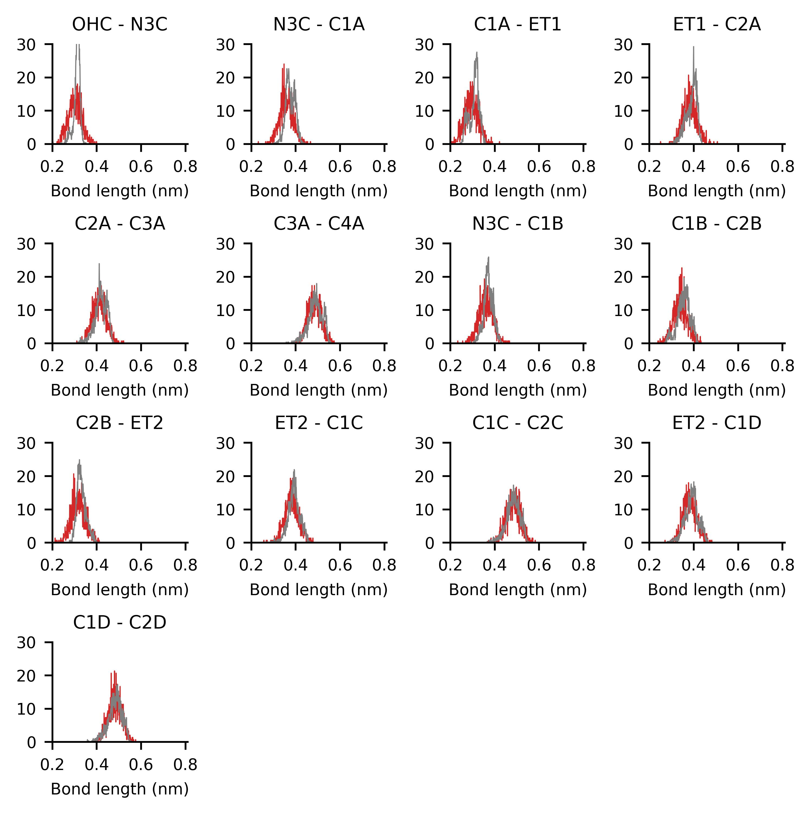
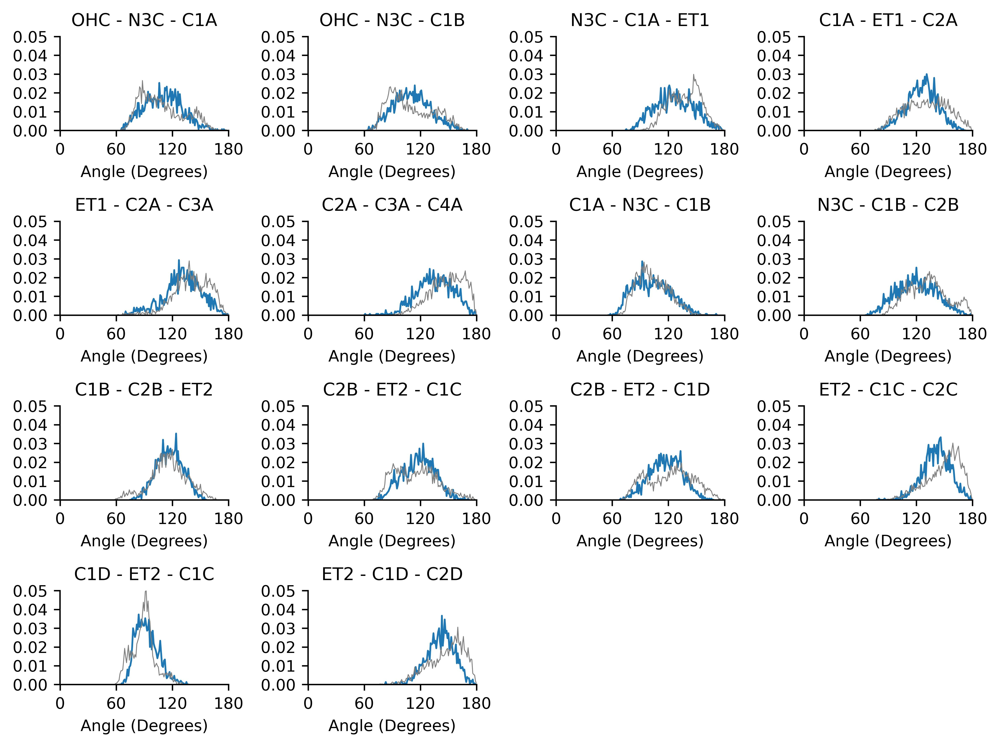
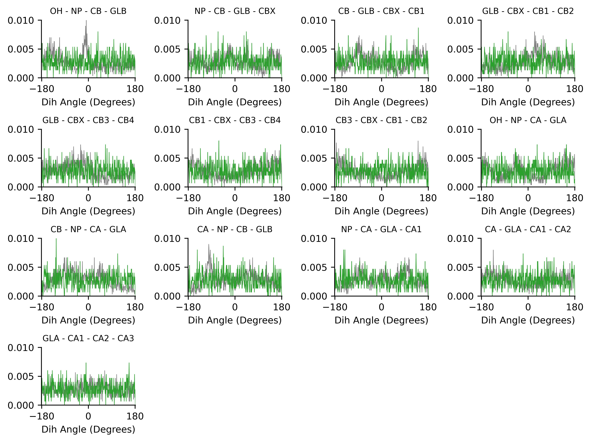

# Parametrizing an Ionizable Lipid to Martini3
This tutorial aims to showcase the parametrization of ionizable lipids to Martini3.

Adapted from the [Parametrization of a new small molecule](https://github.com/ricalessandri/Martini3-small-molecules/blob/main/tutorials/M3tutorials--parameterizing-a-new-small-molecule.md) Martini 3 Tutorial.

Files required and worked examples for this tutorial can be downloaded here.

## Table of contents

[Introduction](#introduction)

[1) Generate atomistic reference data](#1-generate-atomistic-reference-data)

[2) Atom-to-bead mapping](#2-atom-to-bead-mapping)

[3) Generate the CG mapped trajectory from the atomistic simulation](#3-generate-the-cg-mapped-trajectory-from-the-atomistic-simulation)

[4) Create the initial CG itp and tpr files](#4-create-the-initial-cg-itp-and-tpr-files)

[5) Generate target CG distributions from the CG mapped trajectory](#5-generate-target-cg-bonded-parameters-distributions-from-the-cg-mapped-trajectory)

[6) Create the CG simulation](#6-create-the-cg-simulation)

[7) Optimize CG bonded parameters](#7-optimize-cg-bonded-parameters)

[8) Comparison to experimental results, further refinements, and final considerations](#8-comparison-to-experimental-results-further-refinements-and-final-considerations)

[References and notes](#references-and-notes)


## Introduction

In this tutorial we will learn how to build a Martini 3 topology for an ionizable lipid. The aim is to have a pragmatic description of the Martini 3 coarse-graining (CGing) principles [1,2], which follow the main ideas outlined in the seminal Martini 2 work [3].

We will use as an example the molecule SM-102 (Fig. 1), and make use of Gromacs versions 2024.x or later. Required files and worked examples can be downloaded here.

<p align="center">

</p>


## 1) Generate atomistic reference data

We will need atomistic reference data to extract bonded parameters for the CG model. Note that we will need all the hydrogen atoms to extract bond lengths further down this tutorial, so make sure that your atomistic structure contains all the hydrogens.

For SM-102, we will start parametrizing the charged state (SM-102H), and will obtain the atomistic reference data by including SM-102 in a POPC bilayer in a SM-102:POPC (30:70) ratio.

Here, we will use the MolCube server (https://openbeta.molcube.com) to obtain the initial SM-102:POPC (30:70) bilayer. The molecule topology is based on the CHARMM36 force field, but of course feel free to use your favorite atomistic force field. Other web-based services such as the automated topology builder (ATB) or CHARMM-GUI can also be used to obtain reference topologies based on other AA force fields. Another important option is to look in the literature for atomistic studies of the molecule you want to parametrize: if you are lucky, somebody might have already published a validated atomistic force field for the molecule, which you can then use to create reference atomistic simulations.

For the sake of time, in the `files-lnp.zip` directory, we already provided the a GROMACS simulation of SM-102H:POPC (30:70) bilayer in water, ran for 300 ns. For other ILs, you should run your own bilayer simulations. You can now unzip the zip archive provided:

```
unzip  files-lnp.zip
```

which contains a folder called `sm102h-parametrization` that contains some template folders and useful scripts. We will assume that you will be carrying out the tutorial using this folder structure and scripts. Note that the archive contains also a folder called `sm102h-parametrization-worked` where you will find a worked version of the tutorial (trajectories not included). This might be useful to use as reference to compare your files as you go on with the tutorial.

We can now move to the first subfolder, 1_AA-reference, and see the simulation files (in case you run your own simulation, you would copy the files here):

```
cd     sm102h-parametrization/1_AA-reference
ls
```

Check out the files there. Essentially, you would need the files that are necessary for generating the production run `.tpr`

Have a look in the `forcefield` directory and examine the `SM102-H_AA.itp` file, which is the topology based on CHARMM36. Soon, in step 3, we will come back here and change the mass values.

```
cd  forcefield
vim SM102-H_AA.itp
```

## 2) Atom-to-bead mapping

Mapping, i.e., splitting the molecule in building blocks to be described by CG beads, is the heart of coarse-graining and relies on experience, chemical knowledge, and trial-and-error. Here are some guidelines you should follow when mapping a molecule to a Martini 3 model
   * only non-hydrogen atoms are considered to define the mapping;
   * avoid dividing specific chemical groups (e.g., amide or carboxylate) between two beads;
    respect the symmetry of the molecule; it is moreover desirable to retain as much as possible the volume and shape of the underlying AA structure;
    default option for 4-to-1, 3-to-1 and 2-to-1 mappings are regular (R), small (S), and tiny (T) beads; they are the default option for linear fragments, e.g., the two 4-to-1 segments in octane;
   * R-beads are the best option in terms of computational performance, with the bead size reasonably good to represent 4-to-1 linear molecules;
   * T-beads are especially suited to represent the flatness of aromatic rings;
   * S-beads usually better mimic the "bulkier" shape of aliphatic rings;
    the number of beads should be optimized such that the maximum mismatch in mapping is ±1 non-hydrogen atom per 10 non-hydrogen atoms of the atomistic structure;
  * fully branched fragments should usually use beads of smaller size (the rational being that the central atom of a branched group is buried, that is, it is not exposed to the environment, reducing its influence on the interactions); for example, a neopentane group contains 5 non-hydrogen atoms but, as it is fully branched, you can safely model it as a regular bead.

<p align="center">

</p>

A good idea to settle on a mapping is to draw your molecule a few times on a piece of paper, come up with several mappings, compare them, and choose the one that best fulfills the guidelines outlined above.


## 3) Generate the CG mapped trajectory from the atomistic simulation

Using the mapping you just created, you will now transform the simulation you did at 1) to CG resolution. One way to do this is by creating a Gromacs (AA-to-CG) index file where every index group stands for a bead and contains the mapped atom numbers.

Instead of creating an index file by hand from scratch, an initial AA-to-CG index file can be obtained with the [CGbuilder tool](https://jbarnoud.github.io/cgbuilder/) [7]. The intuitive GUI allows to map a molecule on the virtual environment almost as one does on paper. Just load the atomistic pdb/gro file of the molecule, click on the atoms you want to be part of the first bead, click again to remove them if you change your mind, create the next bead by clicking on the "new bead" button, and so on; finally, download the files once done. In fact, the tool allows also to obtain an initial CG configuration (a .gro file) for the beads and a CG-to-AA mapping file (a .map file) based on the chosen mapping. Doesn't this sound better than traditional paper?! Current caveats of CGbuilder include the fact that atoms cannot contribute with a weight different from 1 to a certain bead, something which is sometimes needed when mapping atomistic structures to Martini. In such cases, the index and/or mapping files should be subsequently refined by hand.

Before you get to it: an important change with respect to Martini 2.x is the fact that now hydrogen atoms are taken into account to determine the relative position of the beads when mapping an atomistic structure to CG resolution [1]-[2] - more on this later in this Section. This should be reflected in your AA-to-CG index file, that is, your index should also contain the hydrogens (in CGbuilder terms, click also on the hydrogens!). The general rule is to map a certain hydrogen atom to the bead which contains the non-hydrogen atom it is attached to.

You can now try to map the SM102H_one.gro (which we included in the `2_atom-to-bead-mapping` directory) via CGbuilder. Once done, download the files that CGbuilder creates - ndx, map, and gro - to the `2_atom-to-bead-mapping` directory:

```
cd ../2_atom-to-bead-mapping/
[download cgbuilder.ndx, cgbuilder.map, and cgbuilder.gro and move them to the current folder, i.e., '2_atom-to-bead-mapping']
```

and compare the files obtained to the ones provided in `sm102h-parametrization-worked/2_atom-to-bead-mapping`. Note also that the files provided assume the beads to be ordered in the same way as shown in the Figure of Section 2); it is hence recommended to use the same order to greatly facilitate comparisons.

After having populated your own `sm102h-parametrization/2_atom-to-bead-mapping` subfolder with - at least - the ndx file (let's call it `cgbuilder.ndx`), move to the folder `3_mapped` and copy over the index (we just rename it to `mapping.ndx`), that is:

```
cd  ../3_mapped
cp  ../2_atom-to-bead-mapping/cgbuilder.ndx  mapping.ndx
```

Now, we took into account the hydrogens because center of geometry (COG)-based mapping of AA structures, done taking into account the hydrogen atoms, constitutes the standard procedure for obtaining bonded parameters in Martini 3 [1]-[2]. Hence, we need to consider the hydrogens when mapping the AA structure to CG resolution. Because of a gmx traj unexpected behavior (a potential bug, see note [8]), if we want to stick to gmx traj (like in the good ol' days; alternatives include, e.g., using the MDAnalysis Python library), we need a little hack before being able to run gmx traj. Namely, we need to first create an AA tpr file with the atoms of the atomistic structure all having the same mass. To do this, we will go to `1_AA-reference` folder, and edit the .itp with the modified masses:

```
cd  ../1_AA-reference/forcefield/
vim SM102-H_AA.itp
```

Open SM102-H_AA.itp with your text editor of choice and change the values on the 8th column under the [ atoms ] directive to an equal value (of, for example, 1.0). This column defines the atom mass in a GROMACS topology file. Now, go back to the `3_mapped` folder:

```
cd ../../3_mapped
```
You can now run the script:

```
bash 3_map_trajectory_COG.sh (Just make sure to select the SM102-H group, when asked)
```
which will:

  1. first make sure that the AA trajectory is whole, i.e., your molecule of interest is not split by the periodic boundary conditions in one or more frames in the trajectory file (the gmx trjconv -pbc whole ... command);
  2. subsequently create a AA-COG.tpr, which will be used for the COG mapping in the following step (the gmx grompp -p ... command);
  3. finally, map the AA trajectory to CG resolution (`mapped.xtc`): the gmx traj -f... command contained in 3_map_trajectory_COG.sh will do COG-mapping because it uses the AA-COG.tpr.


## 4) Create the initial CG `itp` and `tpr` files

GROMACS `itp` files are used to define components of a topology as a separate file. In this case we will create one to define the topology for our molecule of interest, that is, define the atoms (that, when talking about CG molecules, are usually called beads), atom types, and properties that make up the molecule, as well as the bonded parameters that define how the molecule is held together.

The creation of the CG `itp` file has to be done by hand, although some copy-pasting from existing `itp` files might help in getting the format right. A thorough guide on the GROMACS specification for molecular topologies can be found in the GROMACS reference manual, however, this tutorial will guide you through the basics.

The first entry in the `itp` is the `[ moleculetype ]`, one line containing the molecule name and the number of nonbonded interaction exclusions. For Martini topologies, the standard number of exclusions is 1, which means that nonbonded interactions between particles directly connected are excluded. For our example this would be:
```
[ moleculetype ]
; molname    nrexcl
  SMH         1
```
The second entry in the `itp` file is `[ atoms ]`, where each of the particles that make up the molecule are defined. One line entry per particle is defined, containing the *beadnumber, beadtype, residuenumber, residuename, beadname, chargegroup, charge, and mass*. For each bead we can freely define a beadname. The residue number and residue name will be the same for all beads in small molecules, such as in this example.

In Martini, we must also assign a bead type for each of the beads. This assignment follows the "Martini 3 Ionizable Lipids" (from Ref. [X]). **You can find a list of beadtypes for other functional groups in the "Martini 3 Bible" in the form of a table at this [link](https://github.com/ricalessandri/Martini3-small-molecules/blob/main/tutorials/building_block_table.pdf)**. In this example, bead number 1 represents the hydroxy group with one carbon attached (and its hydrogens); according to the "Martini 3 Ionizable Lipids" paper this group is represented by the TP1 bead. Check the "Martini 3 Bible" and the ILs parametrized in the "Martini Ionizable Lipids" paper  to see which bead types to use to describe the remaining beads. For a lengthier discussion of bead choices, see the final section of this tutorial.

Each bead will also have its own charge, which in this example will be 0 for all beads except for the NP bead (bead type SQ2p), a tertiary amine. Mass is usually not specified in Martini; in this way, default masses of 72, 54, and 36 a.m.u. are used for R-, S-, and T-beads, respectively. However, when defined the mass of the beads is typically the sum of the mass of the underlying atoms.

For our example, the atom entry for our first bead would be:
```
[ atoms ]
; nr type resnr residue atom cgnr charge mass
   1  TP1   0    SMH    OH    1    0
   2  SQ2p  0    SMH    NP    2    1
...
```
These first two entries in the `itp` file are mandatory and make up a basic `itp`. Finish building your initial CG itp entries and name the file `SM102-H_initial.itp`. The `[ moleculetype ]` and `[ atoms ]` entries are typically followed by entries which define the bonded parameters: `[ bonds ]`, `[ constraints ]`, `[ angles ]`, and `[ dihedrals ]`. For now, you do not need to care about the bonded entries, have a look at the next section **(5)**) for considerations about which bonded terms you will need and how to define them.

Before going onto the next step, we need a CG `tpr` file to generate the distributions of the bonds, angles, and dihedrals from the mapped trajectory. To do this, move to the directory `4_initial-CG`, where you should place the `SM102-H_initial.itp` and that also contains a `system_CG.top`, the `martini_v3.0.0.itp` and a `martini.mdp`. Don't forget to add the new `SM102-H_initial.itp` in the `system_CG.top` header, and then run the script:
```
cd   4_initial-CG
(create the `SM102-H_initial.itp` and include it at the `system_CG.top` header)
bash 4_create_CG_tpr.sh
```
The script will:

  1. extract one frame from your trajectory (mapping it to CG resolution, of course);
  2. use the frame, along with the `top` and `mdp` files (see examples of the latter on the website) to create a `CG.tpr` file for your molecule.


## 5) Generate target CG bonded parameters distributions from the CG mapped trajectory

We need to obtain the parameters of the bonded interactions (bonds, constraints, angles, proper and improper dihedrals) which we want in our CG model from our mapped-to-CG atomistic simulations from step 3). However, which bonded terms do we need to have? Let's go back to the drawing table and identify between which beads there should be bonded interactions.

### 5.1) On the choice of bonded terms for the CG model

```
  OH -  NP -  CB - GLB - CBX - CB1 - CB2
        |                 |
        |                CB3 - CB4
        |
        CA - GLA - CA1 - CA2 - CA3


  1  -  2  -  8  -  9  -  10 - 11 - 12
        |                  |
        |                 13 - 14
        |
        3  -  4  -  5  -  6  -  7
```

Having decided on the bonded terms to use (bonds, constraints, angles, proper and improper dihedrals), they must now be defined in the `itp` file under the `[ bonds ]`, `[ constraints ]`, `[ angles ]`, and `[ dihedrals ]` entries. In general, each bonded potential is defined by stating the atom number of the particles involved, the type of potential involved, and then the parameters involved in the potential, such as reference bond lengths/angle values or force constants. This definition is highly dependent on the type of potentials employed and, as such, users should always reference the [GROMACS manual for specific details](https://manual.gromacs.org/documentation/current/reference-manual/topologies/topology-file-formats.html).

Bonds are defined under [ bonds ] by stating the atom number of the particles involved, the type of bond potential (in this case, type 1, a regular harmonic bond) followed by the reference bond length and force constant. If we use bond 1-2 and 2-3 as examples, your itp should look something like this:

```
[bonds]
; i  j  funct length    kb
  1  2   1     0.32   5000
  2  3   1     0.32   5000 
...
```

Angles and dihedrals follow the same strategy, stating the atom number of the particles involved, the type of potential, and, in this case, the reference angle and force constant. While there are no  dihedral parameters needed in this case, if you do need to add them for other molecules, you can check out the [Parametrization of a new small molecule](https://github.com/ricalessandri/Martini3-small-molecules/blob/main/tutorials/M3tutorials--parameterizing-a-new-small-molecule.md) Martini 3 Tutorial, Section 5.1 for guidance. Let's add one angle and you can try adding the rest:
```
[angles]
; i  j  k  funct  angle     force c.
  1  2  3    1     108        15
...
```
Using initial guesses for the reference bond lengths/angles and force constants you can now create a complete topology for the target molecule. These initial guesses will be improved upon in a further section by comparing the AA and CG bonded distributions and adjusting these values.


### 5.2) Index files and generation of target distributions

Once you have settled on the bonded terms, create index files for the bonds with a directive `[bondX]` for each bond, and which contains pairs of CG beads, for example:
```
[bond1]
  1  2
[bond2]
  2  3
...
```

and similarly for angles (with triples of CG beads) and dihedrals (with quartets). Write scripts that generate distributions for all bonds, angles, and dihedrals you are interested in. For SM-102H, there are 13 bonds and 14 angles. A script is also provided, so that:
```
cd  sm102h-parametrization/5_target-distr
[create bonds.ndx, angles.ndx, and dihedrals.ndx]
bash 5_generate_target_distr.sh
```

will create the distributions. Inspect the folders `bonds_mapped`, `angles_mapped`, and `dihedrals_mapped` for the results. You will find each bond distributions as `bonds_mapped/distr_bond_X.xvg` and a summary of the mean and standard deviations of the mapped bonds as `bonds_mapped/data_bonds.txt`.

For each bond, the script uses the following command (in this example, the command is applied for the first bond, whose index is 0):
```
echo 0 | gmx distance -f ../3_mapped/mapped.xtc -n bonds.ndx -s ../4_initial-CG/CG.tpr -oall bonds_mapped/bond_0.xvg -xvg none
gmx analyze -f bonds_mapped/bond_0.xvg -dist bonds_mapped/distr_bond_0.xvg -xvg none -bw 0.001
```
and similarly for the first angle:
```
echo 0 | gmx angle -f ../3_mapped/mapped.xtc -n angles.ndx -ov ang_mapped/ang_0.xvg
gmx analyze -f ang_mapped/ang_0.xvg -dist ang_mapped/distr_ang_0.xvg -xvg none -bw 1.0
```
and for the first dihedral:
```
echo 0 | gmx angle -type dihedral -f ../3_mapped/mapped.xtc -n dihedrals.ndx -ov dihedrals_mapped/dih_0.xvg
gmx analyze -f dihedrals_mapped/dih_0.xvg -dist dihedrals_mapped/distr_dih_0.xvg -xvg none -bw 1.0
```

## 6) Create the CG simulation

We can now finalize the first take on the CG model, `SM102-H_take1.itp`, where we can use the info contained in the `data_bonds.txt` and `data_dihedrals.txt` files to come up with better guesses for the bonded parameters:

```
cd sm102h-parametrization/6_CG-takeCURRENT
cp ../4_initial-CG/molecule.gro      .
cp ../4_initial-CG/SM102-H_initial.itp  SM102-H_take1.itp
[adjust SM102-H_take1.itp with input from the previous step]
bash prepare_CG_1mol_system.sh  molecule.gro  W.gro  W  1  100
```

where the command will run an energy-minimization, followed by an NPT equilibration, and by an MD run of 300 ns (inspect the script and the various `mdp` files to know more) for the Martini system in water.

Once the MD is run, you can use the index files generated for the mapped trajectory to generate the distributions of the CG trajectory:
```
cp ../5_target-distr/bonds.ndx .
cp ../5_target-distr/dihedrals.ndx .
bash 6_generate_CG_distr.sh
```
which will produce files as done by the `5_generate_target_distr.sh` in the previous step but now for the CG trajectory.

## 7) Optimize CG bonded parameters

You can now plot the distributions against each other and compare. You can use the following scripts:
```
cd sm102h-parametrization
python3 plot_CG_AA_bonds_graphs.py
python3 plot_CG_AA_angles_graphs.py
python3 plot_CG_AA_dihedrals_graphs.py
```
The plots produced should look like the following, for bonds (AA is in gray, Martini is in red):

<p align="center">

</p>

for angles (AA is in gray, Martini is in blue):

<p align="center">

</p>

and dihedrals (AA is in gray, Martini is in green):

<p align="center">

</p>

The agreement is very good. Note that the bimodality of the distributions of some of the dihedrals cannot be captured by the CG model. However, the size of the CG distribution will seemingly capture the two AA configurations into the single CG configuration. If the agreement is not satisfactory at the first iteration - which is likely to happen - you should play with the equilibrium value and force constants in the CG `itp` and iterate till satisfactory agreement is achieved.

## 8) Comparison to experimental results, further refinements, and final considerations

### 8.1) Molecular volume and shape

The approach described so far is oriented to high-throughput applications where this procedure could be automated. However, COG-based mappings cannot necessarily always work perfectly. In case packing and/or densities seem off, it is advisable to look into how the molecular volume and shape of the CG model compare to the ones of the underlying AA structure.

To this end, we can use the Gromacs tool `gmx sasa` to compute the solvent accessible surface area (SASA) and the Connolly surface of the AA and CG models. While AA force fields can use the default `vdwradii.dat` provided by Gromacs, for CG molecules, such file needs to be modified. For this, copy the `vdwradii.dat` file from the default location to the folder where we will execute the analysis:
```
cd sm102h-parametrization/7_SASA
cp /usr/local/gromacs-VERSION/share/gromacs/top/vdwradii.dat  vdwradii_CG.dat
```
The `vdwradii_CG.dat` file in the current folder should now be edited so as to contain the radius of the Martini 3 beads based on the atomnames (!) of your system. By the way, the radii for the Martini R-, S-, and T-beads are 0.264, 0.230, and 0.191 nm, respectively. Take a look at `sm102h-parametrization-worked/7_SASA/vdwradii_CG.dat` in case of doubts.

We also recommend using an updated `vdwradii.dat` for the atomistic reference calculations, instead of the Gromacs default. The file - that you can find among the provided files with the name vdwradii_AA.dat - uses more recent vdW radii from [Rowland and Taylor, J. Phys. Chem. 1996, 100, 7384-7391].

Now, run:
```
bash  7_compute_SASAs.sh  SMH
```
that will compute the SASA and Connolly surfaces for both the CG and AA models. The SASA will be compute along the trajectory, with a command that in the case of the AA model looks like this:
```
gmx sasa -f ../../3_mapped/AA-traj.whole.xtc -s ../../3_mapped/AA-COG.tpr -ndots 4800 -probe 0.191  -o SASA-AA.xvg
```
Note that the probe size is the size of a T-bead (the size of the probe does not matter but you must consistently use a certain size if you want to meaningfully compare the obtained SASA values), and the `-ndots 4800` flag guarantees accurate SASA value. You will instead see that the command used to obtain the Connolly surface uses fewer points (`-ndots 240`) to ease the visualization with softwares such as [VMD](https://www.ks.uiuc.edu/Research/vmd/). Indeed, we can now overlap the Connolly surfaces (computed by the script on the energy-minimized AA structure and its mapped version) by using the following command:
```
vmd  -m  AA/LIG-AA-min-IL_01.gro  AA/surf-AA-IL_01.pdb  CG/surf-CG-IL_01.pdb
```
This should give you some of the views you find rendered below. Below you find also the plot of the distribution of the SASA along the trajectory - `distr-SASA-AA.xvg` and `distr-SASA-CG.xvg` (AA is in gray, Martini is in red):

<p align="center">

</p>

The SASA distributions show a discrepancy of about 5% (the average CG SASA is about 5% smaller than the AA one - see `SASA-AA-individual-IL_01.xvg` and `SASA-CG-individual-IL_01.xvg`), which is acceptable, but not ideal. Inspecting the Connolly surfaces (AA in gray, CG in blue) gives you a clearer picture: while the naphthalene moiety on average seems to be captured quite accurately by the CG model, the T-bead 1 does seem not to account for the whole molecular volume of the ethyl group. One way to improve this could be to lengthen bonds 1-2, and 1-4.

### 8.2) Final considerations

* Mapping of some chemical groups, especially when done at higher resolutions (e.g., in aromatic rings), can vary based on the proximity of functional groups. The rule of thumb is that such perturbations may require a shift of ±1 in the degree of polarity of the bead in question.

* Take inspiration from already-developed models when trying to build a Martini 3 molecule for a new small molecule. Several examples can be found on the Martini 3 small molecule GitHub repo.

* Besides hydrogen bonding labels ("d" donor, and "a" for acceptor), electron polarizability labels are also made available in Martini 3: these mimic electron-rich (label "e") or electron-poor (label "v", for "vacancy") regions of aromatic rings. Such labels have been tested to a less extended degree than d/a labels, but have shown great potentials in applications involving aedamers [1].

* Depending on your application, you may want to include other validation targets, besides free energies of transfer. These can allow you to fine-tune and optimize bead type choices and bonded parameters. Below a non-exhaustive list of potential target properties:

##  References and notes

[1] P.C.T. Souza, et al., [Nat. Methods 2021, DOI: 10.1038/s41592-021-01098-3](https://www.nature.com/articles/s41592-021-01098-3).

[2] R. Alessandri, et al., [Adv. Theory Simul. 2022, DOI: 10.1002/adts.202100391](https://onlinelibrary.wiley.com/doi/full/10.1002/adts.202100391).

[3] S.J. Marrink, et al., [J. Phys. Chem. B. 2007, 111, 7812-7824](https://pubs.acs.org/doi/full/10.1021/jp071097f).

[4] P.C.T. Souza, S. Thallmair, et al., [Nat. Commun. 2020, DOI: 10.1038/s41467-020-17437-5](https://www.nature.com/articles/s41467-020-17437-5).

[5] J. Liu, et al., [Adv. Mater. 2018, DOI: 10.1002/adma.201704630](https://onlinelibrary.wiley.com/doi/10.1002/adma.201704630).

[6] W.L. Jorgensen and J. Tirado-Rives, [PNAS 2005, 102, 6665](https://www.pnas.org/doi/pdf/10.1073/pnas.0408037102); L.S. Dodda, et al., [J. Phys. Chem. B, 2017, 121, 3864](https://pubs.acs.org/doi/full/10.1021/acs.jpcb.7b00272); L.S. Dodda, et al., [Nucleic Acids Res. 2017, 45, W331](https://academic.oup.com/nar/article/45/W1/W331/3747780?login=true).

[7] J. Barnoud, [https://github.com/jbarnoud/cgbuilder](https://github.com/jbarnoud/cgbuilder).

[8] The Gromacs tool `gmx traj` won't allow to choose more than one group unless one passes the flag `-com`. Neither `-nocom` or omitting the flag altogether (which should give `-nocom`) work.

[9] M.N. Melo, H.I. Ingolfsson, S.J. Marrink, [J. Chem. Phys. 2015, 143, 243152](https://pubs.aip.org/aip/jcp/article/143/24/243152/966130/Parameters-for-Martini-sterols-and-hopanoids-based).

[10] S. Natesan, et al., [J. Chem. Inf. Model. 2013, 53, 6, 1424-1435](https://pubs.acs.org/doi/full/10.1021/ci400112k).

[11] L.I. Vazquez-Salazar, M. Selle, et al., [Green Chem. 2020, DOI: 10.1039/D0GC01823F](https://pubs.rsc.org/en/content/articlelanding/2020/gc/d0gc01823f).

[12] J.J. Uusitalo, et al., [J. Chem. Theory Comput. 2015, 11, 8, 3932-3945](https://pubs.acs.org/doi/10.1021/acs.jctc.5b00286).
  - if molecular stacking or packing are of importance, one can use use dimerization free energy landscapes as reference [2];
  - miscibility of binary mixtures has been successfully employed in the parameterization of martini CG solvent models [1] - either by qualitative assessing the mixing behavior or by computing the excess free energy of mixing [1]-[2];
  - other experimental data such as the density of pure liquids or phase transition temperatures [11] can be also used;
  - finally, more specific references are also used, such as the hydrogen-bonding strengths and specificity of interactions for nucleobases [1], following the Martini 2 DNA work [12].
